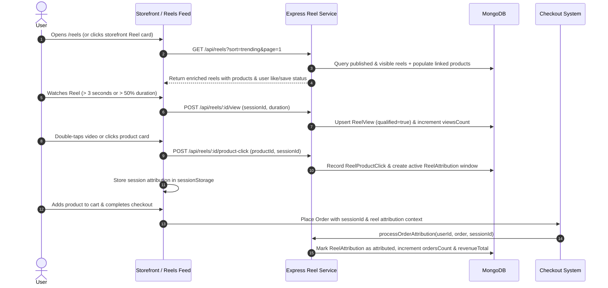

# 🎬 Reels & Shoppable Shorts Module — Comprehensive Scan & Implementation Plan

> **Project Target:** Daya E-Commerce Platform (`E:\CODEVAP PROJECTS\Daya`)  
> **Module:** Reels & Shoppable Shorts (`backend/src/modules/reels/` & `frontend/src/components/reels/`)

---

## Executive Summary

The **Reels & Shoppable Shorts** module is a full-stack, TikTok/Instagram-style short-form video shopping engine built into the Daya E-Commerce platform. It enables users to browse vertical shoppable videos, interact with products (including real-time variant/color swatch selection), comment, like, save, share, and purchase directly with session-based revenue attribution.

---

## 1. Complete Architecture & File Map

```
Daya E-Commerce Root
├── backend/src/modules/reels/
│   ├── models.js                # 12 Mongoose Schemas (Reel, Like, Comment, Reply, Save, Share, View, Clicks, Views, WidgetOpen, Attribution, Conversion)
│   ├── service.js               # Core Business Logic (Media upload, CRUD, View tracking, Engagement, Analytics, Order Attribution)
│   ├── controller.js            # Express Request Handlers & API Responses
│   ├── routes.js                # Public & Admin Express Route Definitions
│   ├── reelProductHelpers.js    # Product Serialization, Swatch Resolution, Stock Status, Linked Products Normalization
│   └── __tests__/               # Integration & Unit Tests for Reels
│
└── frontend/src/
    ├── services/
    │   └── reelService.js       # Client API Service & Session Storage Attribution Helpers
    ├── pages/
    │   ├── ReelsPage.jsx        # Public Immersive Full-Screen Reels Feed Route (/reels)
    │   ├── SavedReelsPage.jsx   # User Bookmarked Reels Route (/saved-reels)
    │   ├── AdminReelsPage.jsx   # Admin Reels Dashboard (/admin/reels)
    │   ├── AdminReelFormPage.jsx# Admin Reel Creator / Editor (/admin/reels/create, /admin/reels/:id/edit)
    │   ├── AdminReelAnalyticsPage.jsx   # Performance & CTR Dashboard (/admin/reels/analytics)
    │   └── AdminReelAttributionPage.jsx # Revenue & Conversion Attribution Dashboard (/admin/reels/attribution)
    └── components/reels/
        ├── ReelsFeed.jsx        # Snap-scrolling vertical video feed with gesture handling & TikTokProductCard
        ├── ReelCarousel.jsx     # Storefront homepage carousel with split background & responsive item pagination
        ├── ReelComponents.jsx   # ReelCard (card & feed layouts), ReelProductOverlay, ReelsSection helper
        ├── ReelCommentDrawer.jsx# Slide-up comment drawer with reply threads
        ├── ReelShareSheet.jsx   # Multi-platform share modal (WhatsApp, Instagram, Copy Link, etc.)
        └── ReelsErrorBoundary.jsx# React error boundary wrapping video player context
```

---

## 2. Database Schema Design (`models.js`)

| Collection | Model Name | Primary Fields | Key Indexes / Constraints |
| :--- | :--- | :--- | :--- |
| `reels` | `Reel` | `title`, `description`, `videoUrl`, `thumbnailUrl`, `cloudinaryPublicId`, `pngTextUrl`, `category`, `tags`, `musicName`, `location`, `status` (*draft, published, archived*), `visibility` (*public, private, unlisted*), `showOnStorefront`, `attributionWindowDays` (default: 30), `linkedProducts`, `associatedProducts`, `createdBy`, metrics (`viewsCount`, `likesCount`, `commentsCount`, `sharesCount`, `savesCount`, `productClicksCount`, `ordersCount`, `revenueTotal`) | `status`, `visibility`, `publishDate`, `createdAt`, `tags`, `category` |
| `reel_likes` | `ReelLike` | `reelId`, `userId` | Unique compound index: `{ reelId: 1, userId: 1 }` |
| `reel_comments` | `ReelComment` | `reelId`, `userId`, `comment`, `parentCommentId`, `isDeleted`, `moderatedAt` | `{ reelId: 1, createdAt: -1 }`, `{ parentCommentId: 1 }` |
| `reel_replies` | `ReelReply` | `reelId`, `commentId`, `userId`, `reply`, `isDeleted` | `{ commentId: 1, createdAt: 1 }` |
| `reel_saves` | `ReelSave` | `reelId`, `userId` | Unique compound index: `{ reelId: 1, userId: 1 }` |
| `reel_shares` | `ReelShare` | `reelId`, `userId`, `platform`, `sessionId` | `{ reelId: 1, createdAt: -1 }` |
| `reel_views` | `ReelView` | `reelId`, `userId`, `sessionId`, `viewDuration`, `videoDuration`, `completionPercent`, `qualified` (*>= 3s or >= 50%*), `ipHash` | Unique compound index: `{ reelId: 1, sessionId: 1 }` |
| `reel_product_clicks` | `ReelProductClick` | `reelId`, `productId`, `userId`, `sessionId`, `clickedAt` | `{ reelId: 1, productId: 1, sessionId: 1, clickedAt: -1 }` |
| `reel_product_views` | `ReelProductView` | `reelId`, `productId`, `userId`, `sessionId`, `viewedAt` | Unique compound index: `{ reelId: 1, productId: 1, sessionId: 1 }` |
| `reel_product_widget_opens` | `ReelProductWidgetOpen` | `reelId`, `userId`, `sessionId`, `openedAt` | `{ reelId: 1, sessionId: 1, openedAt: -1 }` |
| `reel_attributions` | `ReelAttribution` | `reelId`, `productId`, `userId`, `sessionId`, `orderId`, `revenue`, `addToCartAt`, `attributed` | `{ reelId: 1, orderId: 1 }`, `{ sessionId: 1, productId: 1 }` |
| `reel_purchase_conversions` | `ReelPurchaseConversion` | `reelId`, `productId`, `userId`, `orderId`, `sessionId`, `revenue`, `commission`, `attributedAt` | `{ reelId: 1, orderId: 1 }` |

---

## 3. End-to-End User & Business Data Flow



---

## 4. Key Functional Capabilities

### A. Storefront & Mobile Immersive View
- **Snap Vertical Feed (`ReelsFeed.jsx`)**: Full-height (`100dvh`) smooth snap scrolling, intersection-observer playback control, video preloading for next slide.
- **Double-Tap Like Burst**: Micro-animation with heart explosion (`framer-motion`).
- **Shoppable Product Card (`TikTokProductCard`)**: Live color swatch picker, sale price calculation, stock badge, and direct `Shop Now` CTA.
- **Storefront Carousel (`ReelCarousel.jsx`)**: Desktop & tablet responsive slider with ribbed dark background accents.

### B. Interactive Features
- **Comments & Replies**: Slide-up drawer (`ReelCommentDrawer.jsx`), 5-second rate limiting per user, operations notifications.
- **Bookmarking & Sharing**: Multi-platform share sheet (WhatsApp, IG, Copy link) and user profile saved reels grid (`SavedReelsPage.jsx`).

### C. Admin Operations & Attribution Intelligence
- **Reel Manager (`AdminReelsPage.jsx` & `AdminReelFormPage.jsx`)**: Cloudinary media upload (video, thumbnail, PNG text overlay), storefront visibility toggle, attribution window config (1-365 days).
- **Linked Products Editor**: Drag/re-order up to 20 linked products, set featured product flag.
- **Analytics & Attribution Dashboards**: Overall CTR, conversion rate, revenue per reel, and product conversion matrix.

---

## 5. Enhancement & Implementation Plan

To elevate the Reels module from functional to **state-of-the-art**, we outline a 4-Phase Optimization Plan:

### Phase 1: UX & Controls Refinement (Immediate Quick-Wins)
1. **Desktop Keyboard Controls**:
   - `ArrowDown` / `ArrowUp` for smooth slide navigation.
   - `Space` for play/pause.
   - `M` for global mute/unmute toggle.
2. **Global Mute Persistence**:
   - Store audio preference in `localStorage` so user's mute choice persists across video swipes and sessions.
3. **Direct Quick-Add-to-Cart Drawer**:
   - Add a `Quick Add to Cart` button inside `TikTokProductCard` to open `CartDrawer` with selected variant without forcing full page redirection.

### Phase 2: Video Buffering & Network Performance
1. **Adaptive Quality & HLS/DASH Streaming**:
   - Support Cloudinary video transformation parameters (`q_auto,f_auto`) for faster video startup on 3G/4G networks.
2. **Preload Buffer Tuning**:
   - Preload thumbnail and first 2 seconds of the *next two* reels in queue instead of just 1.

### Phase 3: Analytics & Conversion Boosters
1. **In-Video Product Timestamps**:
   - Allow admins to tag timestamp markers (e.g. `00:05` - Product A, `00:15` - Product B) so active product overlay switches automatically as video plays.
2. **Reel-to-Reel Recommendation Engine**:
   - Enhance public list sorting to recommend reels based on category similarity of currently viewed product.

### Phase 4: Verification & Testing
1. **Automated E2E Tests**:
   - Verify view tracking deduplication, like/save persistence, product click attribution storage, and order conversion attribution.
